#  Descripción del Sistema Web: Gestión de Inventario + Ventas
Sistema básico que permite gestionar el inventario, ingreso de productos y registro de ventas
Su desarrollo contiene una interfaz sencilla y de fácil uso.

## 1. Requisitos 
- **XAMPP**: Tener instalado el servidor local (Apache y MySQL).
- **Git/GitHub**: Para clonar o descargar el repositorio.
- **Carpeta de destino**: El proyecto debe ubicarse en`C:/xampp/htdocs/inventario-ventas`.

## 2. Pasos para la instalación 
1. **Descargar el proyecto:** Clona este repositorio en `C:/xampp/htdocs/inventario-ventas`.
2. **Base de Datos:**
   - Ejecutar el panel de XAMPP e inicia **Apache** y **MySQL**.
   - Ingresa a [localhost/phpmyadmin](http://localhost/phpmyadmin/).
   - Crear una base de datos llamada `inventario_ventas`.
   - Importa el archivo `database/productos.sql` de la carpeta del proyecto.
3. **Ejecución:**
 - Para gestionar productos, ingresa a: [http://localhost/inventario-ventas/public/productos.php](http://localhost/inventario-ventas/public/productos.php)
- Para realizar ventas, ingresa a: [http://localhost/inventario-ventas/public/ventas.php](http://localhost/inventario-ventas/public/ventas.php)

## 3. Estructura del Proyecto
- **`/config`**: Contiene `database.php`, encargado de la conexión segura mediante **PDO**.
- **`/controllers`**: Actúa como intermediario. 
  - `ProductoController.php`: Gestiona las peticiones del inventario.
  - `VentaController.php`: Procesa las solicitudes de ventas.
- **`/database`**: Contiene `productos.sql`, el script completo para recrear las tablas y datos de prueba.
- **`/models`**: Capa de datos y acceso a tablas.
  - `Producto.php`: Define las operaciones CRUD de artículos.
  - `Venta.php`: Define el registro de transacciones.
- **`/services`**: Capa de lógica de negocio.
  - `VentaService.php`: Contiene la validación crítica (no permite ventas sin stock suficiente).
- **`/public`**: Carpeta de acceso público y vistas.
  - `productos.php`: Interfaz del CRUD de productos.
  - `ventas.php`: Interfaz del módulo de ventas.
  - Capturas de pantalla (`.png`) de las evidencias de funcionamiento.

## 4. Validaciones implementadas
### Seguridad y Acceso
- **Acceso Directo**
### Validación de Productos (Módulo 1)
- **Nombre Obligatorio**
- **Precio Positivo**
- **Stock No Negativo** 
### Validación de Ventas (Módulo 2)
- **Control de Existencias**

## 5. Capturas Evidencias de Funcionamiento y Pruebas
### Módulo 1: Inventario
### Base de Datos
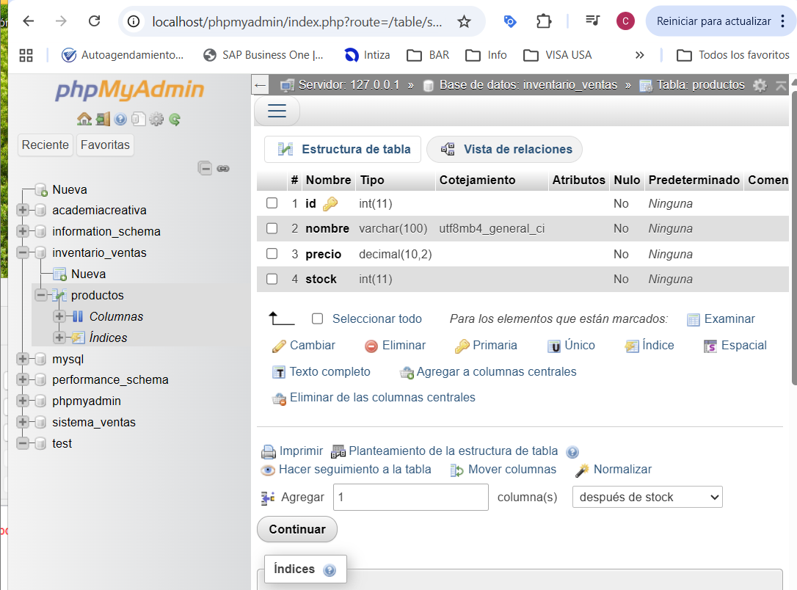
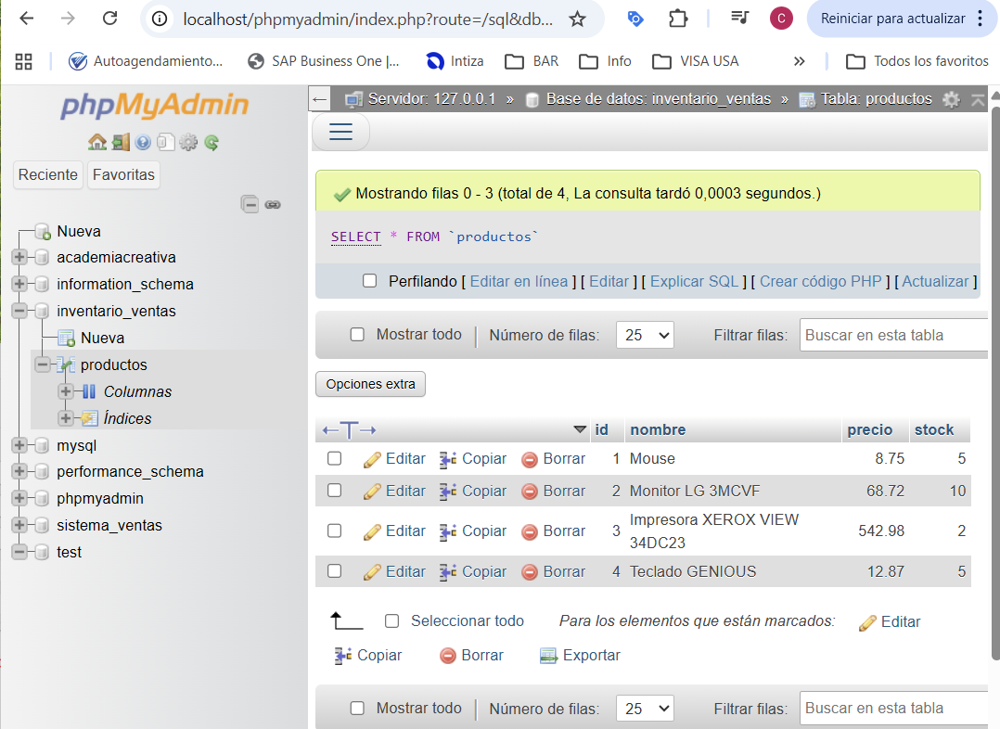

### Interfaz y Registro
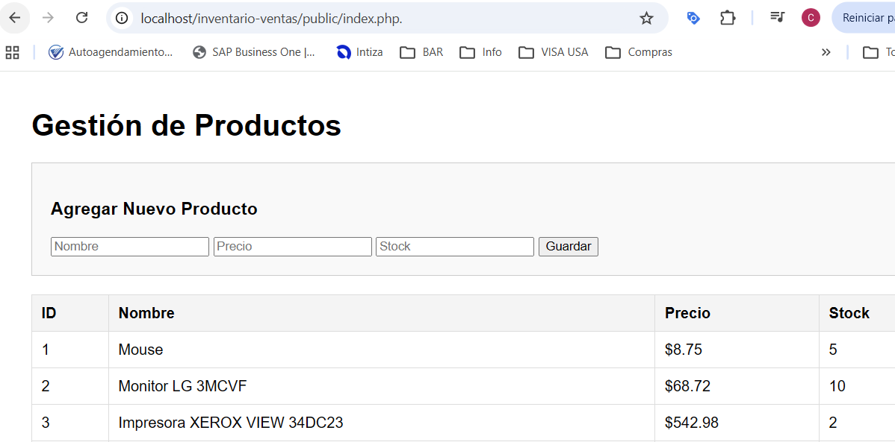
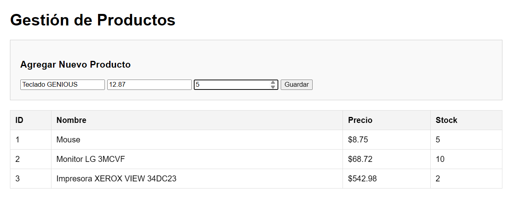
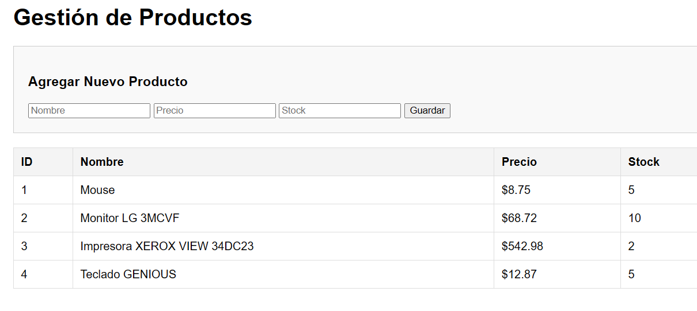

### Pruebas de Validaciones
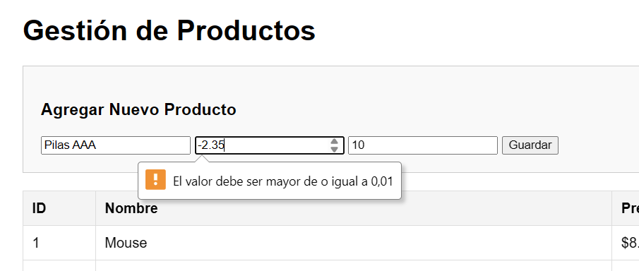
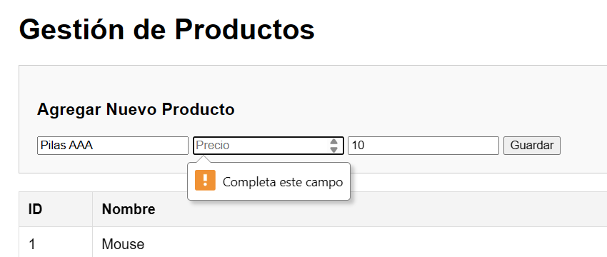

### Edición de Productos
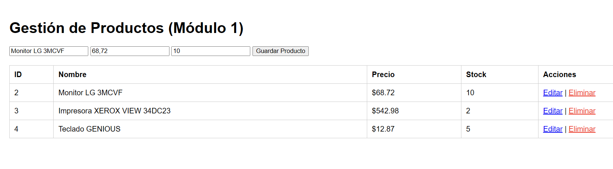

### Eliminación de Productos
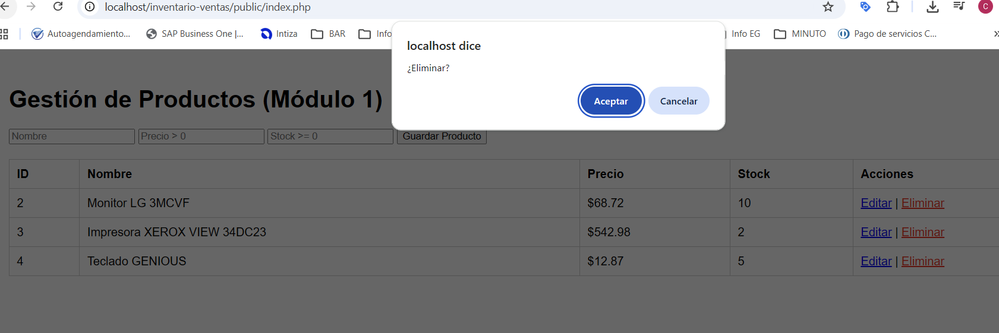

### Módulo 2: Gestión de Ventas y Stock
El sistema cuenta con un servicio que valida la existencia de productos antes de procesar una transacción.

### Registro de Venta Exitosa:
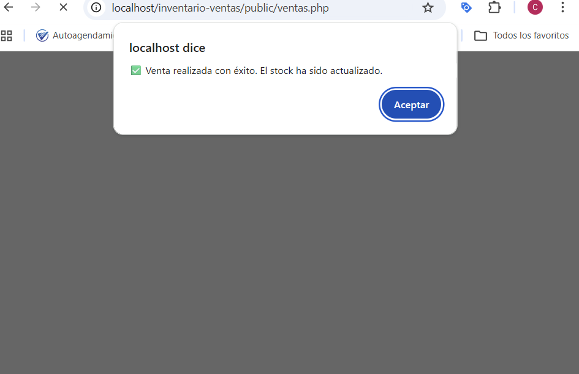

### Validación de Stock Insuficiente:
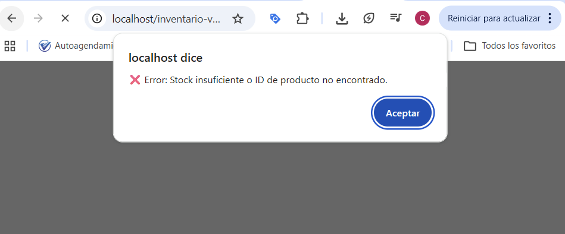

### Actualización Automática de Inventario:
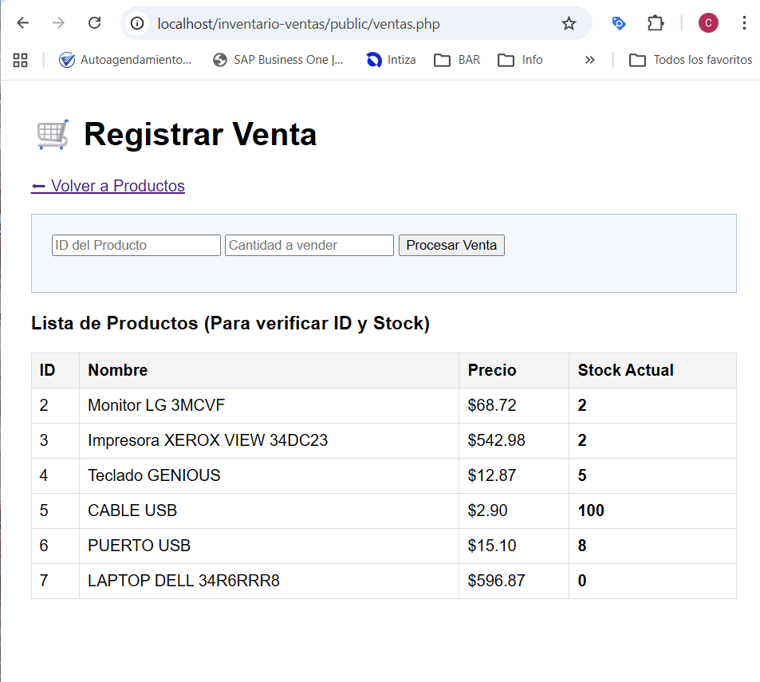

